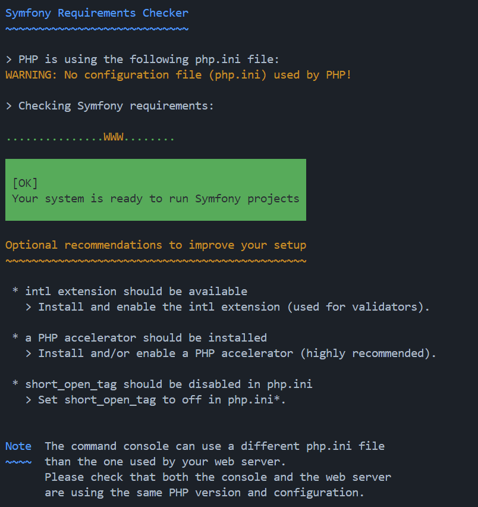
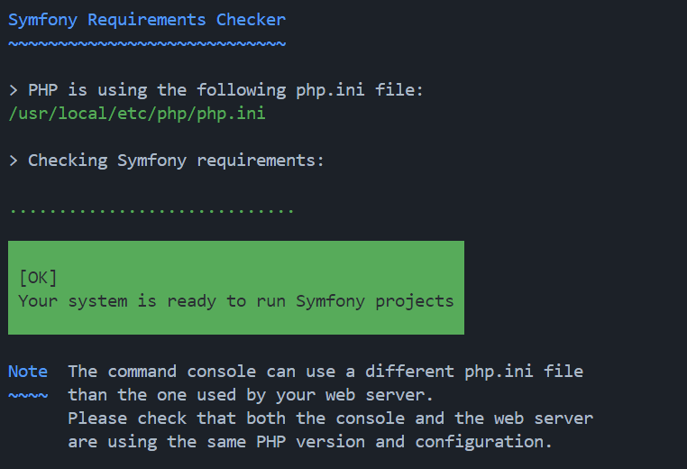
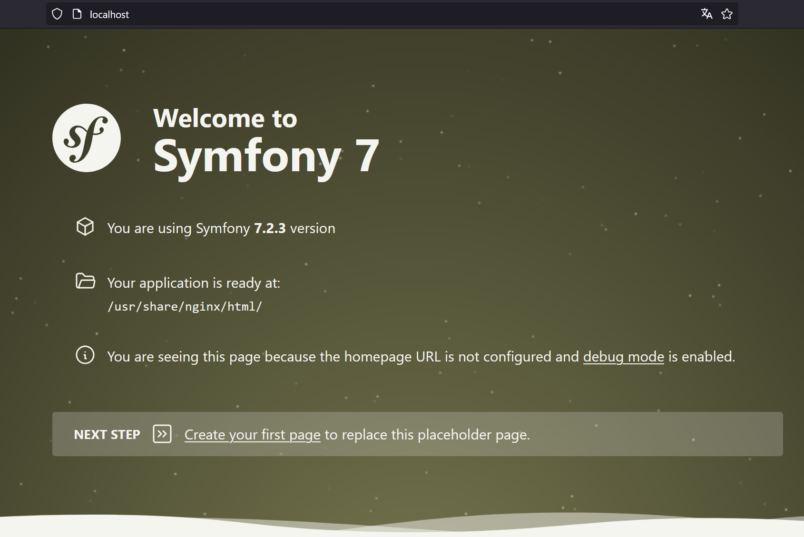
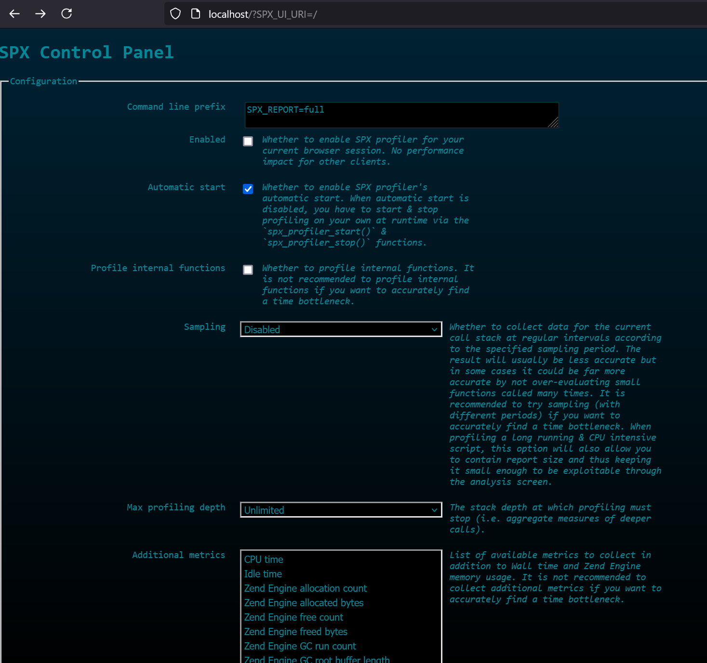
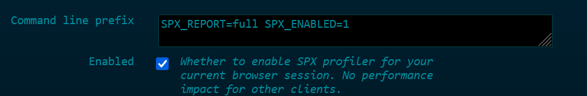
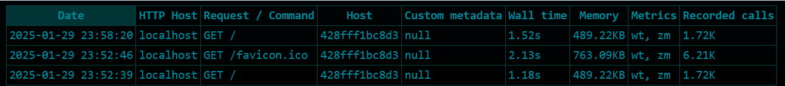
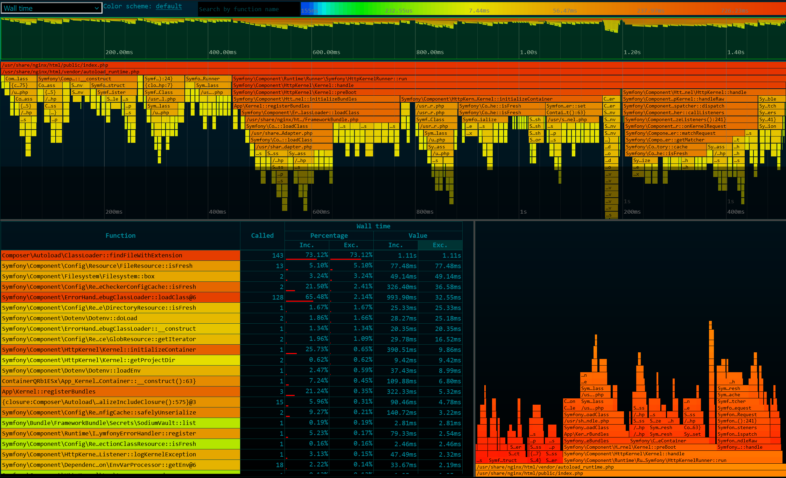

# Docker Symfony Profiling

## Step 1 : Symfony Requirements Validation

```Dockerfile
FROM php:8.4-cli

RUN apt-get update && apt-get install -y \
    libpq-dev \
    && docker-php-ext-install pdo_pgsql pgsql \
    && apt-get clean && rm -rf /var/lib/apt/lists/*
```

Add this lines in `docker/php-cli/Dockerfile`

```sh
RUN curl -sS https://get.symfony.com/cli/installer | bash
RUN mv /root/.symfony5/bin/symfony /usr/local/bin/symfony
```

```sh
docker-compose run --rm php-cli symfony check:requirements
```



Add opcache.ini

```ini
opcache.enable=1
opcache.memory_consumption=128
opcache.max_accelerated_files=4000
opcache.validate_timestamps=0
```

Add custom php.ini

```ini
short_open_tag=Off
```

Update Dockerfile

```Dockerfile
FROM php:8.4-cli

RUN apt-get update && apt-get install -y \
    libpq-dev \
    libicu-dev \
    git \
    && docker-php-ext-install pdo_pgsql pgsql intl opcache \
    && docker-php-ext-enable intl opcache \
    && apt-get clean && rm -rf /var/lib/apt/lists/*

COPY opcache.ini /usr/local/etc/php/conf.d/opcache.ini
COPY php.ini /usr/local/etc/php/php.ini

RUN curl -sS https://get.symfony.com/cli/installer | bash
RUN mv /root/.symfony5/bin/symfony /usr/local/bin/symfony
```

Tada !



## Step 2 : Create a New Symfony Project

```sh
docker-compose run --rm composer create-project symfony/skeleton:"7.2.x" demo
```

Move all files from demo into it's parent directory

Build & Start containers

```sh
docker-compose up -d --build
```

Go to http://localhost



## Step 3 : Profiling http requests

Update php-fpm Dockerfile (docker/php-fpm/Dockerfile) in order to install php-spx

```Dockerfile
FROM php:8.4.3-fpm-bullseye

RUN apt-get update && apt-get install -y \
    libpq-dev \
    libicu-dev \
    zlib1g-dev \
    git \
    && docker-php-ext-install pdo_pgsql pgsql intl opcache \
    && docker-php-ext-enable intl opcache \
    && apt-get clean && rm -rf /var/lib/apt/lists/*

WORKDIR /tmp
RUN git clone https://github.com/NoiseByNorthwest/php-spx.git \
    && cd php-spx \
    && git checkout release/latest \
    && phpize \
    && ./configure \
    && make \
    && make install

RUN echo 'extension=spx.so' >> 	/usr/local/etc/php/conf.d/docker-fpm.ini
RUN echo 'spx.http_enabled=1 \n\
spx.http_ip_whitelist="*" \n\
spx.http_key="dev" \n' >> /usr/local/etc/php/conf.d/docker-fpm.ini

COPY opcache.ini /usr/local/etc/php/conf.d/opcache.ini
COPY php.ini /usr/local/etc/php/php.ini
```

Rebuild php-fpm

```sh
docker-compose build php-fpm
```

Restart application

```sh
docker-compose down -v
docker-compose up -d
```

You can access to spx dashboard using http://localhost/?SPX_UI_URI=/



Enable profiling



Refresh http://localhost, go back to spx dashboard and you will see requests at the bottom of the page



When selecting `GET /` we will redirected to this page



## Step 4 : Profiling from the command line

Update php-cli Dockerfile (docker/php-cli/Dockerfile) in order to install php-spx

```Dockerfile
FROM php:8.4-cli

RUN apt-get update && apt-get install -y \
    libpq-dev \
    libicu-dev \
    zlib1g-dev \
    git \
    && docker-php-ext-install pdo_pgsql pgsql intl opcache \
    && docker-php-ext-enable intl opcache \
    && apt-get clean && rm -rf /var/lib/apt/lists/*

COPY opcache.ini /usr/local/etc/php/conf.d/opcache.ini
COPY php.ini /usr/local/etc/php/php.ini

RUN curl -sS https://get.symfony.com/cli/installer | bash
RUN mv /root/.symfony5/bin/symfony /usr/local/bin/symfony

RUN apt-get update && apt-get install -y zlib1g-dev git \
    && apt-get clean && rm -rf /var/lib/apt/lists/*

WORKDIR /tmp
RUN git clone https://github.com/NoiseByNorthwest/php-spx.git \
    && cd php-spx \
    && git checkout release/latest \
    && phpize \
    && ./configure \
    && make \
    && make install

RUN echo 'extension=spx.so' >> 	/usr/local/etc/php/conf.d/docker-cli.ini
RUN echo 'spx.http_enabled=1 \n\
spx.http_ip_whitelist="*" \n\
spx.http_key="dev" \n' >> /usr/local/etc/php/conf.d/docker-cli.ini
```

Clear cache

```sh
docker-compose run --rm php-cli php -d SPX_ENABLED=1 -d SPX_REPORT=ful bin/console cache:warmup
```
