# Docker Symfony Guide

This is a step by step guide showing how to build a simple Application using Docker

## Step 1

Symfony is a PHP application running over a web server. So first we have to select which php version to use.

In this guide we will use php-fpm 8.4 with nginx as web server.

Docker images can be pulled from public registry [https://hub.docker.com](https://hub.docker.com)

We can search for images using docker cli

```sh
docker search php
```
Many images are listed, but we will use the official docker image :

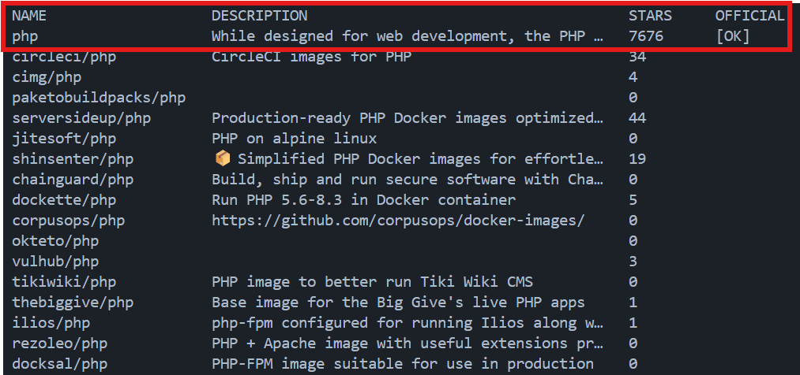

As we can see the name of the image is **php** without prefix. So we can access to the image using the url [https://hub.docker.com/_/php](https://hub.docker.com/_/php)

All availables releases are listed in the **tags** tab. 

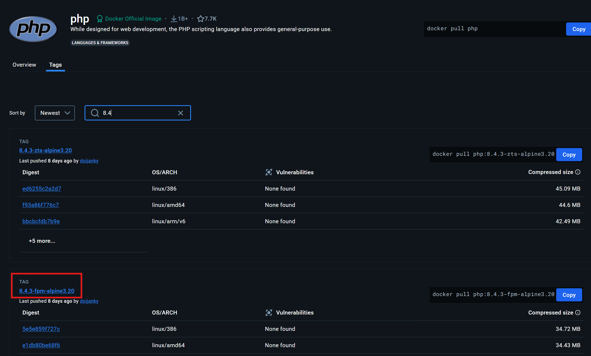

For this guide we will use [8.4.3-fpm-alpine3.20](https://hub.docker.com/layers/library/php/8.4.3-fpm-alpine3.20/images/sha256-5e5e859f727caf04a4a26c09157b6eeb60b801b04d164ab153257266e8c2647a)

So let's go and start the container 

```sh
docker run php:8.4.3-fpm-alpine3.20
```

Docker will first pull the image from the registry and next start php-fpm

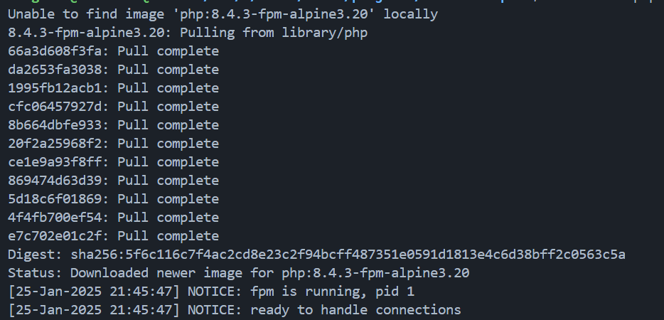

The container is now ready to handle connections, it can be stopped by running `Ctrl C`.

We can reproduce the same approach in order to find nginx image, we will use the latest available release : 

```sh
docker run nginx
```

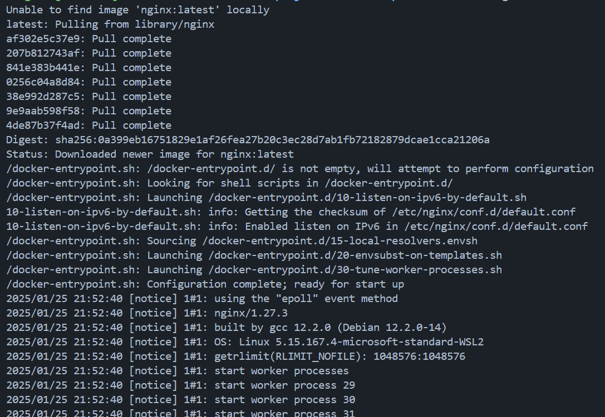

The container start the server with multiple workers and it ready to use however at this point if you open your browser to http://localhost nothing will be displayed. In order to access the nginx welcome page, we have to forward the port 80, so first we have to stop the container using `Ctrl C` and next run the following command :

```sh
docker run -p 80:80 nginx
```

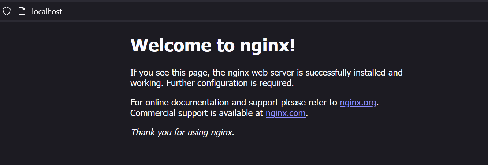

## Step 2

We are now able to start php and nginx containers, the next step will be to use them together and display a basic `index.php` file. Let's go!

index.php file creation

```sh
mkdir src
touch src/index.php
echo -e "<?php\n\nphpinfo();" > src/index.php
```

Add nginx configuration

```sh
mkdir -p docker/nginx
touch docker/nginx/nginx.conf
```

nginx.conf file content

```nginx
user www-data;
worker_processes 5;
events { worker_connections 1024; }

http {
    default_type application/octet-stream;
    charset utf-8;
    server_tokens off;
    tcp_nopush on;
    tcp_nodelay off;

    server {
        root /usr/share/nginx/html;

        location / {
            try_files $uri /index.php$is_args$args;
        }
        location ~ ^/(index)\.php(/|$) {
            fastcgi_pass php:9000;
            fastcgi_split_path_info ^(.+\.php)(/.*)$;
            include fastcgi_params;
            fastcgi_param SCRIPT_FILENAME $document_root$fastcgi_script_name;
            fastcgi_param DOCUMENT_ROOT $document_root;
        }
    }
}
```

Create a new docker network in order to allow communication between containers

```sh
docker network create app-network
```

Start php-fpm
```sh
docker run --rm --network app-network --name php -v $PWD/src:/usr/share/nginx/html php:8.4.3-fpm-alpine3.20
```

Start nginx

```sh
docker run --rm --network app-network --name nginx -p 80:80 -v $PWD/docker/nginx/nginx.conf:/etc/nginx/nginx.conf:ro -v $PWD/src:/usr/share/nginx/html nginx
```

Result on http://localhost

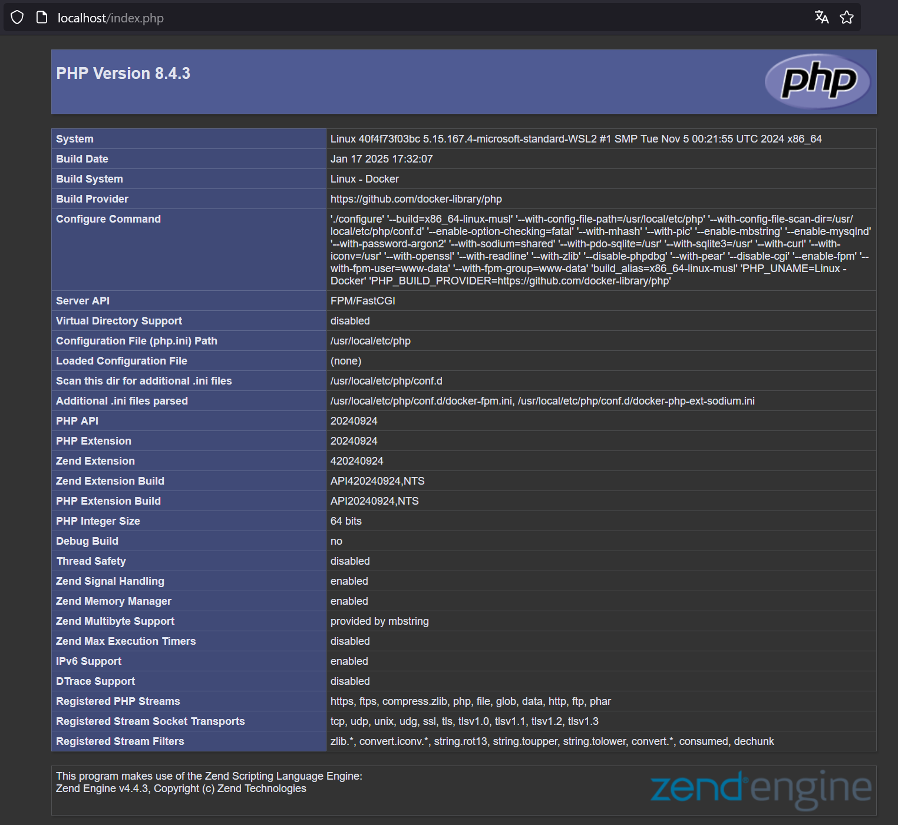

## Step 3

In this step we will add a postgres database and use the Doctrine orm in order to manipulate entities.

Doctrine can be installed by using composer, so we will init a new project and require dependencies : 

```sh
docker run --rm --interactive --tty --volume $PWD:/app composer init
```

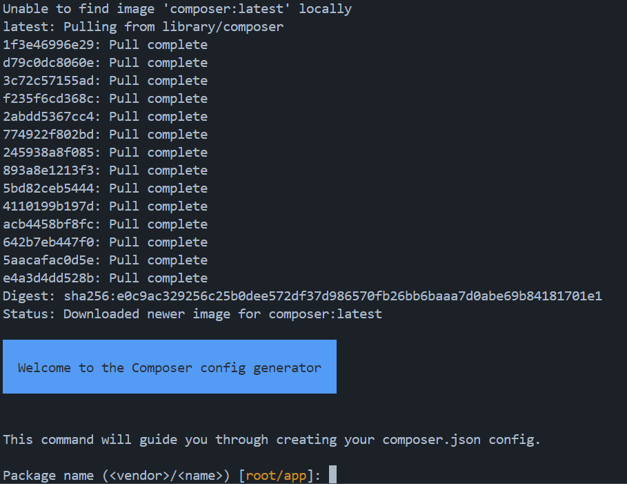

- Package name: docker/app
- Description: leave empty
- Author: leave empty
- Minimum Stability: leave empty
- Package Type: leave empty
- License: leave empty
- Would you like to define dependencies: yes
- Search for a package: doctrine/orm
- Enter the version constraint to require: leave empty
- Search for a package: doctrine/dbal
- Enter the version constraint to require: leave empty
- Search for a package: symfony/cache
- Enter the version constraint to require: leave empty
- Search for a package: leave empty
- Would you like to define your dev dependencies: n
- Add PSR-4 autoload mapping? Maps namespace "Docker\App" to the entered relative path. [src/, n to skip]: tap enter
- Do you confirm generation: yes
- Would you like to install dependencies now: yes

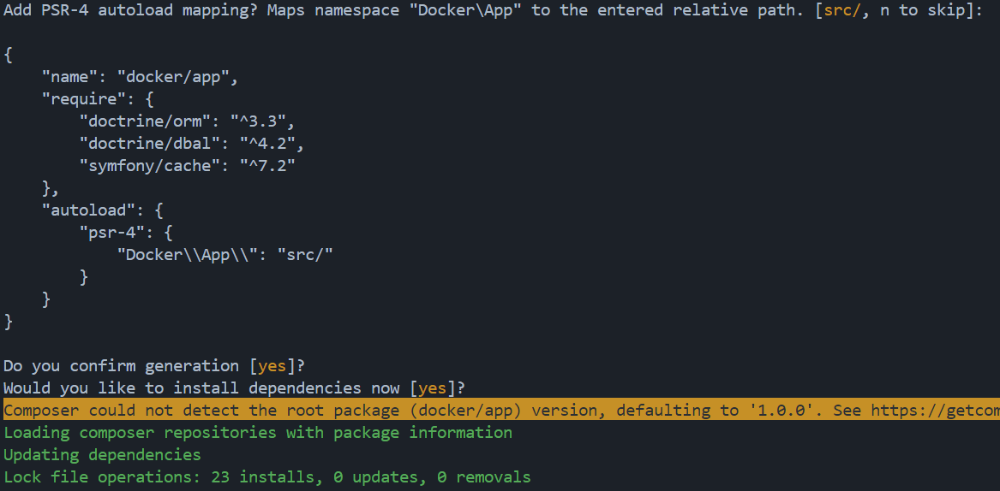

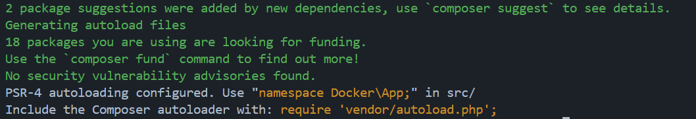

Composer installation is done and we can see the vendor directory, composer.json and composer.lock files

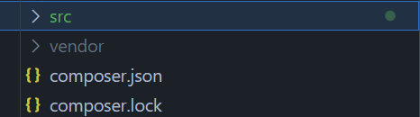

Now we can configure Doctrine

Create bootstrap.php file

```sh
touch bootstrap.php
```

```php
<?php

use Doctrine\DBAL\DriverManager;
use Doctrine\ORM\EntityManager;
use Doctrine\ORM\ORMSetup;

require_once "vendor/autoload.php";

$config = ORMSetup::createAttributeMetadataConfiguration(
    paths: [__DIR__ . '/src'],
    isDevMode: true,
);

$connection = DriverManager::getConnection([
    'driver' => 'pdo_pgsql',
    'user' => 'postgres',
    'password' => 'secret',
    'dbname' => 'postgres',
    'host' => 'postgres',
    'port' => 5432
], $config);

$entityManager = new EntityManager($connection, $config);
```

Create the bin/doctrine file

```sh
mkdir bin
touch bin/doctrine
```

```php
#!/usr/bin/env php
<?php

use Doctrine\ORM\Tools\Console\ConsoleRunner;
use Doctrine\ORM\Tools\Console\EntityManagerProvider\SingleManagerProvider;

require __DIR__ . '/../bootstrap.php';

ConsoleRunner::run(
    new SingleManagerProvider($entityManager)
);
```

```sh
docker run --rm --volume $PWD:/user/src/app php:8.4-cli php /user/src/app/bin/doctrine
```
Result

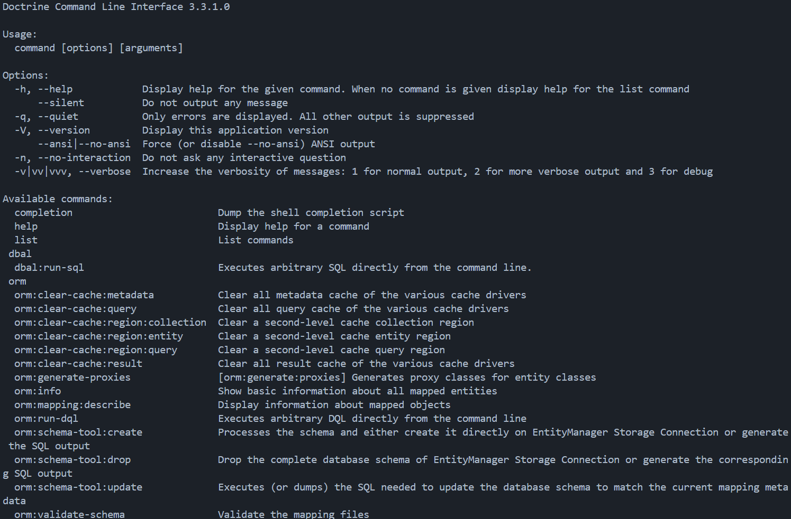

```sh
docker run --rm --volume $PWD:/user/src/app php:8.4-cli php /user/src/app/bin/doctrine orm:schema-tool:create
```

```sh
docker run --rm --volume $PWD:/user/src/app php:8.4-cli php /user/src/app/bin/doctrine orm:schema-tool:update --force --dump-sql
```

```sh
mkdir -p src/BusinessRules/Entities
touch src/BusinessRules/Entities/Album.php
```

```php
<?php

namespace Docker\App\BusinessRules\Entities;

use Doctrine\ORM\Mapping as ORM;

#[ORM\Entity]
#[ORM\Table(name: 'albums')]
class Album
{
    #[ORM\Id]
    #[ORM\Column(type: 'integer')]
    #[ORM\GeneratedValue]
    public readonly ?int $id;

    public function __construct(
        #[ORM\Column(type: 'string')]
        public string $title,
        #[ORM\Column(type: 'string')]
        public string $artist,
    ) {}

    public function getId(): ?int
    {
        return $this->id;
    }
}
```

Now we can try to update the schema again

```sh
docker run --rm --volume $PWD:/user/src/app php:8.4-cli php /user/src/app/bin/doctrine orm:schema-tool:update --force --dump-sql
```

The following error should be displayed

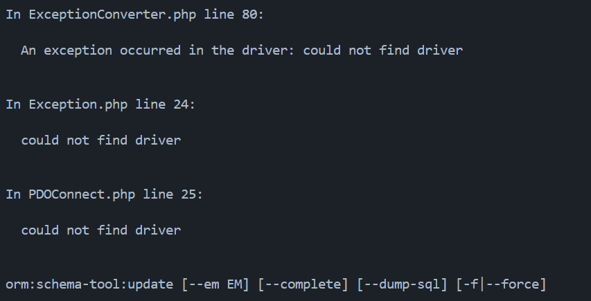

This errors appears because pgsql driver is not installed in `php:8.4-cli`. In order to fix this error we will use a Dockerfile and add the extension, let's go!

```sh
mkdir -p docker/php-cli
touch docker/php-cli/Dockerfile
```

```Dockefile
FROM php:8.4-cli

RUN apt-get update && apt-get install -y \
    libpq-dev \
    && docker-php-ext-install pdo_pgsql pgsql \
    && apt-get clean && rm -rf /var/lib/apt/lists/*
```

Build a new image called my-php-cli

```sh
cd docker/php-cli
docker build -t my-php:8.4-cli .
``` 

We can now view the new image 

```sh
docker images | grep php
```

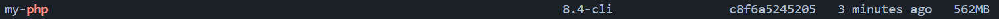

So now we can try to create entities using our newest image `my-php:8.4-cli`

```sh
docker run --rm --volume $PWD:/user/src/app my-php:8.4-cli php /user/src/app/bin/doctrine orm:schema-tool:update --force --dump-sql
```

Ooops, we've got another error

```sh
In ExceptionConverter.php line 77:
                                                                               
  An exception occurred in the driver: SQLSTATE[08006] [7] could not translat  
  e host name "postgres" to address: Name or service not known                 
                                                                               

In Exception.php line 24:
                                                                               
  SQLSTATE[08006] [7] could not translate host name "postgres" to address: Na  
  me or service not known                                                      
                                                                               

In PDOConnect.php line 25:
                                                                               
  SQLSTATE[08006] [7] could not translate host name "postgres" to address: Na  
  me or service not known                                                      
                                                                               

orm:schema-tool:update [--em EM] [--complete] [--dump-sql] [-f|--force]
```

This error is about unkown host **postgres**, we have now to start the postgres container :)

Open a new terminal and run the following command

```sh
docker run --rm --name postgres --network app-network -e POSTGRES_PASSWORD=secret postgres
```

Next in another terminal 

```sh
docker run --rm --network app-network --volume $PWD:/user/src/app my-php:8.4-cli php /user/src/app/bin/doctrine orm:schema-tool:update --force --dump-sql
```

Success! 

```sh
Updating database schema...

CREATE TABLE products (id INT GENERATED BY DEFAULT AS IDENTITY NOT NULL, name VARCHAR(255) NOT NULL, PRIMARY KEY(id));
     1 query was executed

[OK] Database schema updated successfully!
```

So here we go, we can now add some records in our new table 'albums'. We will use a simple php script.

```sh
touch createAlbums.php
```

```php
<?php

require_once "bootstrap.php";

use Docker\App\BusinessRules\Entities\Album;

$fixtures = [
  [
    'title' => 'Burn My Eyes',
    'artist' => 'Machine Head'
  ],
  [
    'title' => 'Aggression Continuum',
    'artist' => 'Fear Factory'
  ],
  [
    'title' => 'Black Album',
    'artist' => 'Metallica' 
  ]
];

foreach ($fixtures as $fixture) {
    $album = new Album(
        title: $fixture['title'], 
        artist: $fixture['artist']
    );

    $entityManager->persist($album);
    $entityManager->flush();

    echo "Created album with ID " . $album->getId() . "\n";
}
```

```sh
docker run --rm --network app-network --volume $PWD:/user/src/app my-php:8.4-cli php /user/src/app/createAlbums.php
```

Result

```text
Created album ID 1
Created album ID 2
Created album ID 3
```

Last but not least, let's display the list!

Create a new index.php file in the project root directory

```sh
touch index.php
```

```php
<?php

require_once __DIR__.'/bootstrap.php';

$albumRepository = $entityManager->getRepository(Docker\App\BusinessRules\Entities\Album::class);
$albums = $albumRepository->findAll();

$str = '<h1>Albums</h1>';
$str .= '<ul>';
foreach ($albums as $album) {
    $str .= '<li>'.$album->title.' ('.$album->artist.')</li>';
}
$str .= '</ul>';

echo $str;
```

Add pgsql in php-fpm

```sh
mkdir -p docker/php-fpm
touch docker/php-fpm/Dockerfile
```

```Dockerfile
FROM php:8.4.3-fpm-alpine3.20

RUN apk add --no-cache \
    postgresql-dev \
    && docker-php-ext-install pdo_pgsql pgsql
```

Build the image

```sh
cd docker/php-fpm
docker build -t my-php:8.4.3-fpm-alpine3.20 .
``` 

Start containers (in separate terminals)

Start postgres
```sh
docker run --rm --name postgres --network app-network -e POSTGRES_PASSWORD=secret postgres
```

Start php-fpm
```sh
docker run --rm --network app-network --name php -v $PWD:/usr/share/nginx/html my-php:8.4.3-fpm-alpine3.20
```

Start nginx

```sh
docker run --rm --network app-network --name nginx -p 80:80 -v $PWD/docker/nginx/nginx.conf:/etc/nginx/nginx.conf:ro -v $PWD:/usr/share/nginx/html nginx
```

Result

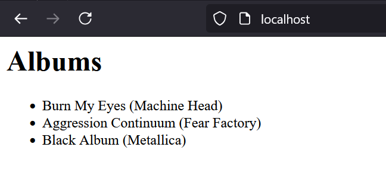

Congratulations! This simple page is displayed using 3 containers, we can see them with this command

```sh
docker ps
```

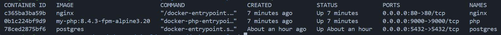

We can now stop all containers by using `Ctrl C` in each terminal.

## Step 4

In this last step we will introduce `docker-compose` in order to make our life easier :)

Instead of running each container one by one we will create a special file in order to manage them all in one place. Let's go!

```sh
touch docker-compose.yml
```

```yml
networks:
  app-network:

services:

  postgres:
    image: postgres:latest
    container_name: postgres
    environment:
      POSTGRES_PASSWORD: secret
    networks:
      - app-network

  php-fpm:
    build: ./docker/php-fpm
    container_name: php
    working_dir: /usr/share/nginx/html
    volumes:
      - .:/usr/share/nginx/html
    networks:
      - app-network

  nginx:
    image: nginx:latest
    working_dir: /usr/share/nginx/html
    volumes:
      - ./docker/nginx/nginx.conf:/etc/nginx/nginx.conf:ro
      - .:/usr/share/nginx/html
    ports:
      - 80:80
    networks:
      - app-network

  php-cli:
    build: ./docker/php-cli
    volumes:
      - .:/user/src/app
    networks:
      - app-network
    working_dir: /user/src/app

  composer:
    image: composer:latest
    volumes:
      - .:/app

```

Init database

```sh
docker-compose run php-cli bin/doctrine orm:schema-tool:update --force --dump-sql
```

Add records

```sh
docker-compose run php-cli php createAlbums.php
```

Start application

```sh
docker-compose up -d
```

Add a new dev dependency

```sh
docker-compose run composer require --dev phpunit/phpunit
```

Stop Application

```sh
docker-compose down -v
```

That's it! As we can see all settings have been moved into `docker-compose.yml`, command are becoming more simples and it allow to start/stop containers in a breeze!